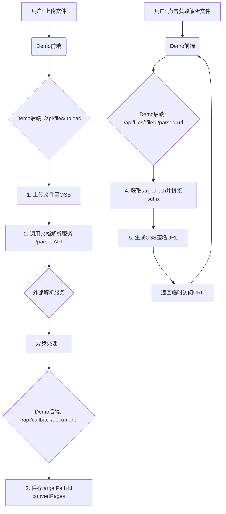

# 文档解析服务 API文档

本文档描述了文档解析服务的对外API接口，支持PPT、Word、Excel、PDF等格式的文档解析。

## 服务概述

文档解析服务提供异步文档解析能力，支持多种文档格式转换为标准格式。服务采用异步处理模式，通过回调机制通知解析结果。

## 基础信息

- **服务地址**: `https://www.plaso.cn/dataentry/document`
- **Content-Type**: `application/json`
- **字符编码**: UTF-8
- **认证方式**: AppId + SecretKey


## API接口

### 1. 创建文档解析任务

提交文档解析任务，系统会异步处理并在完成后通过回调通知结果。

**接口地址**: `POST /parser`

**请求参数**:
| 参数名 | 类型 | 必填 | 说明 |
|--------|------|------|------|
| appId | string | 是 | 应用ID，用于标识调用方及其配置 |
| sourcePath | string | 是 | 源文件的存储路径（OSS路径格式：oss://bucket/file） |
| targetPath | string | 否 | 解析后的存储路径（OSS路径格式：oss://bucket/dir）, 不传默认为 ${sourcePath}_i |
| taskType | number | 是 | 任务类型，详见任务类型说明 |
| callbackUrl | string | 是 | 任务处理完成后用于通知结果的回调URL |
| validBegin | number | 是 | 请求开始时间戳（秒） |
| validTime | number | 是 | 请求有效时长（秒），建议300秒 |
| signature | string | 是 | 签名，用于请求验证 |

**任务类型 (taskType)**:
| 类型 | 值 | 说明 |
|------|----|----|
| EXTERNAL_PPT | 4 | PPT文档 |
| EXTERNAL_DOC | 5 | Word/Excel文档 |
| EXTERNAL_PDF | 8 | PDF文档 |


**请求示例**:
```json
{
  "appId": "your-app-id",
  "sourcePath": "oss://your-bucket/path/to/document.pptx",
  "taskType": 4,
  "callbackUrl": "https://your-callback-url.com/api/callback/document",
  "validBegin": 1703123456,
  "validTime": 300,
  "signature": "A1B2C3D4E5F6G7H8I9J0K1L2M3N4O5P6Q7R8S9T0"
}
```

**解析后文件保存路径**:
- 解析完成后，回调信息中的 `targetPath` 字段会返回解析后文件所在的目录路径 (OSS Key)。
- 例如：`u001/20240910/xxxx/`
- 具体的解析产物（如图片）需要将此 `targetPath` 与文件名（如 `1.jpg`）拼接后获取。

**签名生成规则**:
1. 将所有参数（除signature外）按参数名升序排列
2. 以`key=value`格式用`&`连接：`appId=xxx&callbackUrl=xxx&sourcePath=xxx&taskType=4&validBegin=1703123456&validTime=300`
3. 使用HMAC-SHA1算法，以SecretKey为密钥对上述字符串进行加密
4. 将结果转换为大写十六进制字符串作为signature

**时间参数说明**:
- `validBegin`: 当前时间戳（秒），建议使用`Math.floor(Date.now() / 1000)`
- `validTime`: 请求有效期（秒），建议300秒（5分钟）
- 服务会验证请求时间是否在有效期内，防止重放攻击

**成功响应**:
```json
{
  "code": 0,
  "msg": "success",
  "obj": {
    "taskId": "654e1c9a7b8d9e001a2b3c4d"
  }
}
```

**错误响应**:
```json
{
  "code": 1001,
  "msg": "源文件路径不存在"
}
```

**cURL示例**:
```bash
curl -X POST \
  https://www.plaso.cn/dataentry/document/parser \
  -H 'Content-Type: application/json' \
  -d '{
    "appId": "your-app-id",
    "sourcePath": "oss://your-bucket/path/to/document.pptx",
    "taskType": 4,
    "callbackUrl": "https://your-callback-url.com/api/callback/document",
    "validBegin": 1703123456,
    "validTime": 300,
    "signature": "A1B2C3D4E5F6G7H8I9J0K1L2M3N4O5P6Q7R8S9T0"
  }'
```

## 回调机制

### 解析结果回调

文档解析完成后，服务会调用您提供的回调URL通知解析结果。

**回调地址**: 您在创建任务时提供的 `callbackUrl`

**调用方**: 文档解析服务

**请求参数**:
| 参数名 | 类型 | 必填 | 说明 |
|---|---|---|---|
| taskId | string | 是 | 任务ID |
| taskStatus | number | 是 | 任务状态，详见状态值说明 |
| targetPath | string | 否 | 解析成功时返回，表示解析后文件所在的目录路径 (OSS Key) |
| convertPages | number | 否 | 解析成功时返回，表示成功转换的页数 |

**状态值说明**:
| 状态值 | 状态名称 | 说明 |
|--------|----------|------|
| 100 | DONE | 解析成功 |
| 101 | FAILED | 解析失败 |


### 回调重试机制

服务会按照以下策略重试回调：

**重试策略**:
- 首次回调失败后，等待5秒重试
- 最多重试3次
- 重试间隔递增：5秒、10秒、20秒
- 3次重试后仍失败，任务标记为回调失败

**重试条件**:
- HTTP状态码 >= 500
- 网络超时
- 连接失败

## 错误码说明

| 错误码 | 错误类型 | 说明 |
|--------|----------|------|
| 0 | SUCCESS | 成功 |
| 4 | INPUT_DATA_ERROR | 输入数据错误（例如，`sourcePath` 未提供） |
| 7 | INADEQUATE_PRIVILEGE | 权限不足（例如，机构未开通服务或OSS配置不存在） |
| 270000 | NOT_SUPPORT | 不支持的文件解析 |
| 270001 | TASK_HAS_FULL | 任务队列已满 |


## 使用流程

以下流程图和说明描述了如何完整地集成和使用文档解析服务，并展示了本Demo中的后端实现逻辑。



### Demo后端实现要点

1.  **文件上传和任务创建** (`/api/files/upload`)
    -   接收前端上传的文件。
    -   将文件上传到您自己的阿里云OSS Bucket中，得到文件`ossKey`。
    -   调用文档解析服务的 `POST /parser` 接口，请求中传入上一步得到的`sourcePath` (`oss://<your-bucket>/<ossKey>`) 和用于接收结果的`callbackUrl`。
    -   在本地保存文件信息和返回的`taskId`。

2.  **回调处理** (`/api/callback/document`)
    -   创建一个公网可访问的接口，用于接收文档解析服务的异步回调。
    -   回调请求的Body中会包含任务`id`、任务状态`taskStatus`、解析产物路径`targetPath`和转换页数`convertPages`。
    -   根据`id`找到对应的文件记录，并将`targetPath`和`convertPages`等信息保存下来，同时将文件状态更新为`completed`或`failed`。

3.  **获取解析文件** (`/api/files/:fileId/parsed-url`)
    -   为前端提供一个接口，用于获取最终解析产物（如图片）的访问地址。
    -   此接口接收`fileId`和具体的文件名`suffix`（例如 `1.jpg`）作为参数。
    -   从存储中查询到之前保存的`targetPath`，并将其与`suffix`拼接成完整的OSS Object Key。
    -   **注意**：`targetPath`可能包含`oss://<bucket>/`前缀，在调用签名方法前需要将其移除。
    -   使用`ali-oss`的`signatureUrl`方法为拼接好的Object Key生成一个带签名的、有时间限制的公开访问URL，并返回给前端。

## 使用示例

### JavaScript/Node.js

```javascript
const axios = require('axios');

// 生成签名
function generateSignature(params, secretKey) {
  const crypto = require('crypto');
  const keys = Object.keys(params).sort();
  const res = [];
  
  for (const key of keys) {
    if (key === 'signature' || params[key] === undefined) {
      continue;
    }
    res.push(`${key}=${params[key]}`);
  }
  
  const content = res.join('&');
  return crypto.createHmac('sha1', secretKey).update(content).digest('hex').toUpperCase();
}

// 创建文档解析任务
async function createParseTask(filePath, callbackUrl, secretKey) {
    const validBegin = Math.floor(Date.now() / 1000);
    const validTime = 300;
    
    const requestData = {
      appId: 'your-app-id',
      sourcePath: `oss://your-bucket/${filePath}`,
      taskType: 4, // EXTERNAL_PPT
      callbackUrl: callbackUrl,
      validBegin: validBegin,
      validTime: validTime
    };
    
    // 生成签名
    requestData.signature = generateSignature(requestData, secretKey);

  try {
    const response = await axios.post(
      'https://www.plaso.cn/dataentry/document/parser',
      requestData,
      {
        headers: {
          'Content-Type': 'application/json'
        }
      }
    );
    
    console.log('任务创建成功:', response.data);
    return response.data.data.taskId;
  } catch (error) {
    console.error('任务创建失败:', error.response?.data || error.message);
    throw error;
  }
}

// 注意：文档解析服务不提供任务状态查询接口
// 请通过回调机制获取解析结果

// 实现回调接口
const express = require('express');
const app = express();

app.use(express.json());

app.post('/api/callback/document', (req, res) => {
  const { taskId, status, result, error } = req.body;
  
  console.log('收到解析回调:', { taskId, status, result, error });
  
  // 处理解析结果
  if (status === 100) { // DONE
    console.log('解析成功:', result);
    // 保存解析结果到数据库
    // 通知用户解析完成
  } else if (status === 101) { // FAILED
    console.log('解析失败:', error);
    // 处理解析失败
  }
  
  res.json({
    success: true,
    message: '回调处理成功',
    taskId: taskId
  });
});

// 使用示例
async function main() {
  try {
    // 创建解析任务
    const taskId = await createParseTask(
      'documents/presentation.pptx',
      'https://your-service.com/api/callback/document',
      'your-secret-key'
    );
    
    // 注意：不需要轮询检查状态，通过回调获取结果
    
  } catch (error) {
    console.error('操作失败:', error);
  }
}

main();
```

